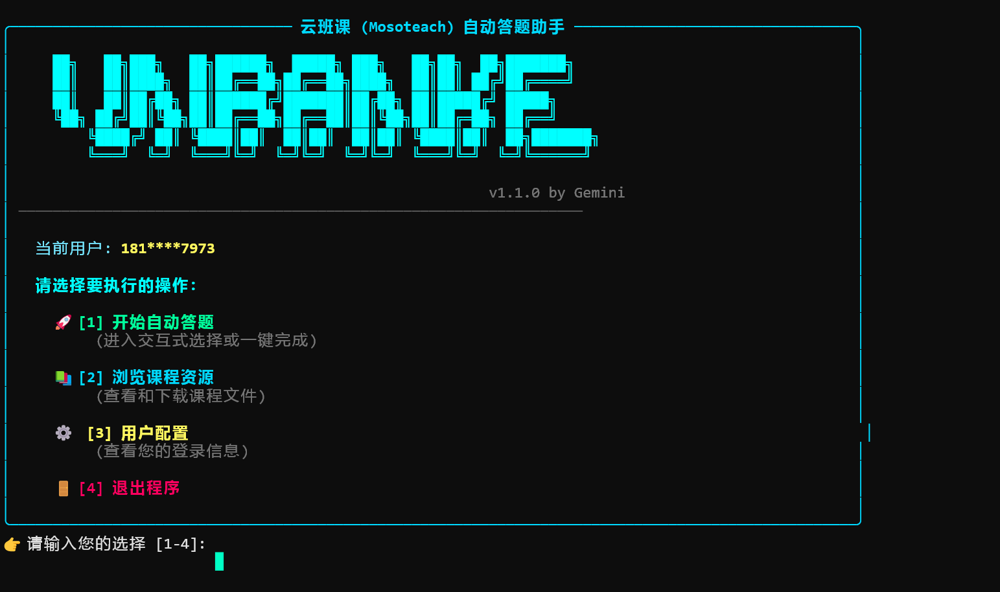

## 一个自动化云班课做题的脚本 现已兼容Linux系统🎉

## ui界面🎞️

## 注意❗
- 由于需要用到大语言模型，需要您从阿里云百炼里获得API_key并在user_data文件里配置,目前gemini连接不稳定建议不要使用
- 在user_data文件里配置您的云班课用户名和密码
- 由于项目使用了selenium需要chromedriver来启动，所以如果您没有这个软件👇[点击转到下载地址](https://googlechromelabs.github.io/chrome-for-testing/)，如果有这个软件需要您在yun_ban_ke.py这个文件配置chromedriver的路径
- linux系统的chromedriver安装较为繁琐，请自行解决

## 第三方库🧰
  - rich、selenium、lxml、requests、openai、dashscope
